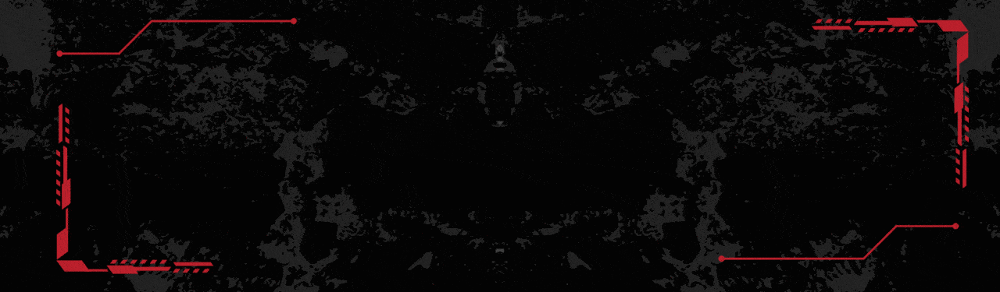

  

<h1 align="center">Hi  I am SOUMIK MUKHERJEE 😉🎯  </h1>

  

##
<h3 align="center">Java Full Stack Developer and Backend Engineer</h3>

 I also have experience in Frontend, Backend,  Mobile, Security

##

<h2 align="center"> JAVA | DSA | HTML/CSS | SQL | FLUTTER | JAVASCRIPT </h2>

  

  
  
  
  
  
  
  
  
  
  
  
  
  
  
  
  
  
  
  
  
  
  
  
  
  
  
  
  
  
  
  
  
  
  
  
  
  
  
  
  
  
  
  
  
  
  
  
  
  
  
  
  
  
  
  
  
  
  
  
  
  
    
  
    
  
    
  
    
  
    
  
    
  
    
  
    
  
    
  
   
  
 
  
 
  

##

- 📫 How to reach me *onlinekazama19@gmail.com*

 SOUMIK MUKHERJEE 

<!-- -->

<!---
soumikjee/soumikjee is a ✨ special ✨ repository because its `README.md` (this file) appears on your GitHub profile.
You can click the Preview link to take a look at your changes.
--->
